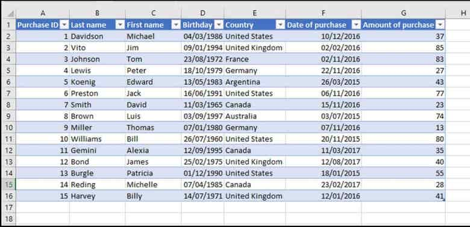
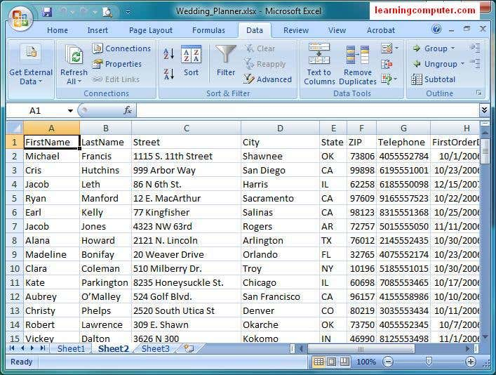

<!DOCTYPE html>
<html lang="en">
<head>
  <meta charset="UTF-8" />
  <meta name="viewport" content="width=device-width, initial-scale=1.0" />
  <title>Md. Harun Or Rashid</title>
  <link rel="stylesheet" href="style.css" />
  
<header>
  <!DOCTYPE html><html lang="en">
<head>
  <meta charset="UTF-8">
  <meta name="viewport" content="width=device-width, initial-scale=1.0">
  <title>Md. Harun Or Rashid</title>
  
</head>
<body>
<header>
  Md. Harun Or Rashid
  <button class="menu-button" onclick="toggleMenu()">&#8942;</button>
</header>

  <a href="#" onclick="showSection('profile')">Profile</a>
  <a href="#" onclick="showSection('privacy')">Privacy Policy</a>
  <a href="#" onclick="showSection('contact')">Contact</a>
  <a href="#" onclick="showSection('about')">About</a>
  <a href="#" onclick="showSection('settings')">Settings</a>
  <a href="#" onclick="showSection('certificate')">Certificates</a>
  <a href="#" onclick="showSection('media')">Tutorial</a>
  <a href="assets/Harun_CV.pdf" download>Download CV</a>
  <a href="mailto:hmharun796@gmail.com?subject=Hello&body=I want to connect with you.">Send Email</a>

  <h2>Profile</h2>
  
I am Md. Harun Or Rashid, a skilled and dedicated professional specializing in data entry, web research, and PDF to Excel conversions. I also create Payoneer account tutorials and provide project-based services through platforms like Fiverr.

  <h2>Privacy Policy</h2>
  
All information collected through this site is used solely to improve user experience and will not be shared with third parties. You may contact me for any concerns about your data privacy.

  <h2>Contact</h2>
  
Email: hmharun796@gmail.com 
     Phone: +880 1648-131500 
     Facebook: <a href="https://www.facebook.com/share/r/1BcEg68nzy/" target="_blank">Visit My Facebook</a> 
     WhatsApp: <a href="https://wa.me/8801648131500" target="_blank">Chat on WhatsApp</a>
  

  <h2>About</h2>
  
I'm passionate about providing efficient data entry and digital solutions. My goal is to ensure client satisfaction through quality work and timely delivery. I also manage a YouTube channel for educational content.

  <h2>Settings</h2>
  
Website Theme: Default 
     Language: English 
     Notifications: Enabled 
     <em>(Settings options can be expanded based on development needs)</em>
  

  <h2>Certificates</h2>
  <ul>
    <li></li>
    <li></li>
    <li></li>
  </ul>

  <h2>Tutorial</h2>
  
Watch my video tutorials on YouTube:

  <video controls width="320">
    <source src="video.mp4" type="video/mp4">
    Your browser does not support the video tag.
  </video>
  
<a href="https://youtube.com/@mdharun-n6j" target="_blank">Visit My YouTube Channel</a>

  <h2>My Profile</h2>
  
  
<strong>Name:</strong> Md. Harun Or Rashid

  
<strong>Address:</strong> Manikganj, Dhaka, Bangladesh

  
<strong>Email:</strong> hmharun796@gmail.com

  
<strong>Education:</strong> SSC, Lemubari Binoda Sundori High School

  
<strong>Profession:</strong> Freelancer

  
<strong>Skills:</strong> Data Entry, E-commEntry, Web Research, Data Research, Web Scraping, Data Scraping, Copy-Paste, and more.

  <h2>Privacy Policy</h2>
  
We do not share your personal information.

  <h2>Contact</h2>
  
<strong>Phone:</strong> +8801648131500

  
<strong>Phone:</strong> +8801316888404

  
<strong>Email:</strong> hmharun796@gmail.com

  <a href="mailto:hmharun123@gmail.com?subject=Hiring Request&body=Hello, I would like to hire you for a project." target="_blank">
    <button class="button">Order Now</button>
  </a>
  <a href="https://wa.me/8801795815184?text=Hi%20Harun,%20I%20am%20interested%20in%20your%20services." target="_blank">
    <button class="button" style="background-color: #25D366;">Order on WhatsApp</button>
  </a>

  

    <a class="button fiverr" href="https://www.fiverr.com/s/dDlW3G3" target="_blank">Visit My Fiverr Profile</a>
    <a class="button" href="https://www.facebook.com/share/r/1BcEg68nzy/" target="_blank">Visit My Facebook</a>
    <a class="button" href="https://www.instagram.com/p/DIeAfFXT_oO/" target="_blank">View My Instagram</a>
    <a class="button" href="https://www.tiktok.com/@user6071584366187" target="_blank">TikTok</a>
    <a class="button" href="https://wa.me/8801648131500?text=Hi,%20I%20want%20to%20contact%20you" target="_blank">WhatsApp</a>
  

  <h2>About</h2>
  
I am a freelancer specialized in data entry and online tasks.

  <h2>Settings</h2>
  
Settings coming soon.

  <h2>Certificate of Completion</h2>
  
  

  <h2>Payoneer Account Creation Tutorial</h2>
  <iframe width="560" height="315" src="https://www.youtube.com/embed/bWgg3zyC8PQ" title="Payoneer Account Creation Tutorial" frameborder="0" allowfullscreen></iframe>

  <h2>My Photo & Video</h2>
  
  <video controls width="400">
    <source src="media/Ami_Soia_Geleo_Soibena_Bidhata.mp4" type="video/mp4">
    Your browser does not support the video tag.
  </video>

  
  
  
  
  
  

  <h2>My Gallery</h2>
  

    
    
    
    
  

<a id="projects" class="section">
  <h2>My Projects</h2>
  
Here are some examples of the data entry work I've done:

  

    
    
    
    
    
    
  

    <a href="https://docs.google.com/spreadsheets/d/1FSV3CzDlRSDJHaumYrCcvKFcBKGedUhFU9qPDY6viW4/edit?usp=drivesdk" target="_blank">Sample Data Entry Work</a>
    <a href="https://drive.google.com/file/d/1xA2EXAMPLE123/view" target="_blank">Product Listing (Excel)</a>
    <a href="https://drive.google.com/file/d/1yB3EXAMPLE456/view" target="_blank">Web Research Sample</a>
    <a href="https://drive.google.com/file/d/1zC4EXAMPLE789/view" target="_blank">PDF to Excel Conversion</a>
  

  <h2>My YouTube Channel</h2>
  
Subscribe to my channel for tutorials, tips, and more!

  <a class="button" href="https://youtube.com/@mdharun-n6j" target="_blank">Visit My YouTube</a>

  <h2>My Portfolio</h2>
  
Here are some examples of the data entry work I've done:

  

    <a class="button" href="https://docs.google.com/spreadsheets/d/1FSV3CzDlRSDJHaumYrCcvKFcBKGedUhFU9qPDY6viW4/edit?usp=drivesdk" target="_blank">Sample Data Entry Work</a>
    <a class="button" href="https://drive.google.com/file/d/1xA2EXAMPLE123/view" target="_blank">Product Listing (Excel)</a>
    <a class="button" href="https://drive.google.com/file/d/1yB3EXAMPLE456/view" target="_blank">Web Research Sample</a>
    <a class="button" href="https://drive.google.com/file/d/1zC4EXAMPLE789/view" target="_blank">PDF to Excel Conversion</a>
  

<head>
   <link rel="stylesheet" href="https://cdnjs.cloudflare.com/ajax/libs/font-awesome/6.4.0/css/all.min.css" />
  <meta charset="UTF-8">
  <title>HM Harun Portfolio</title>
  <link rel="stylesheet" href="style.css">
</head>
<body>

<!-- Navigation -->
<nav>
  <a href="#home">Home</a>
  <a href="#about">About</a>
  <a href="#projects">Projects</a>
  <a href="#contact">Contact</a>
  <a href="assets/Harun_CV.pdf" class="btn" download>Download CV</a>
</nav>

<!-- Projects Section -->
<section id="projects" class="section">
  <h2>My Projects</h2>
  
Here are some examples of the data entry work I've done:

  

    
    
    
    
    
    
  

  

    <a href="https://docs.google.com/spreadsheets/d/1FSV3CzDlRSDJHaumYrCcvKFcBKGedUhFU9qPDY6viW4/edit?usp=drivesdk" target="_blank">Sample Data Entry Work</a>
    <a href="https://drive.google.com/file/d/1xA2EXAMPLE123/view" target="_blank">Product Listing (Excel)</a>
    <a href="https://drive.google.com/file/d/1yB3EXAMPLE456/view" target="_blank">Web Research Sample</a>
    <a href="https://drive.google.com/file/d/1zC4EXAMPLE789/view" target="_blank">PDF to Excel Conversion</a>
  

</section>

<!-- About Section -->
<section id="about" class="section">
  <h2>About Me</h2>
  
Your short bio goes here.

</section>

<!-- Tutorial Section -->
<section class="section">
  <h2>Payoneer Account Creation Tutorial</h2>
</section>

<!-- Photo & Video Section -->
<section class="section">
  <h2>My Photo & Video</h2>
  
My Photo

  <video controls>
    <source src="video.mp4" type="video/mp4">
    Your browser does not support the video tag.
  </video>
</section>

<!-- Gallery -->
<section class="section">
  <h2>My Gallery</h2>
  
Photo 1 | Photo 2 | Photo 3 | Photo 4

</section>

<!-- YouTube -->
<section class="section">
  <h2>My YouTube Channel</h2>
  
Subscribe to my channel for tutorials, tips, and more!

  <a href="https://youtube.com/@mdharun-n6j" target="_blank">Visit My YouTube</a>
</section>

<!-- Portfolio -->
<section class="section">
  <h2>My Portfolio</h2>
  <ul>
    <li><a href="https://docs.google.com/spreadsheets/d/1FSV3CzDlRSDJHaumYrCcvKFcBKGedUhFU9qPDY6viW4/edit?usp=drivesdk">Sample Data Entry Work</a></li>
    <li><a href="https://drive.google.com/file/d/1xA2EXAMPLE123/view">Product Listing (Excel)</a></li>
    <li><a href="https://drive.google.com/file/d/1yB3EXAMPLE456/view">Web Research Sample</a></li>
    <li><a href="https://drive.google.com/file/d/1zC4EXAMPLE789/view">PDF to Excel Conversion</a></li>
  </ul>
</section>

<section class="links">
  <a href="https://www.facebook.com/share/r/1BcEg68nzy/" class="btn blue" target="_blank">
    <i class="fa-brands fa-facebook-f"></i> Facebook
  </a>
  <a href="https://youtube.com/@mdharun-n6j" class="btn red" target="_blank">
    <i class="fa-brands fa-youtube"></i> YouTube
  </a>
  <a href="https://wa.me/8801648131500?text=Hi,%20I%20want%20to%20contact%20you" class="btn darkgreen" target="_blank">
    <i class="fa-brands fa-whatsapp"></i> WhatsApp
  </a>
  <a href="https://www.instagram.com/p/DIeAfFXT_oO/" class="btn purple" target="_blank">
    <i class="fa-brands fa-instagram"></i> Instagram
  </a>
  <a href="https://www.tiktok.com/@user6071584366187" class="btn pink" target="_blank">
    <i class="fa-brands fa-tiktok"></i> TikTok
  </a>
  <a href="https://www.fiverr.com/s/dDlW3G3" class="btn green" target="_blank">
   Fiverr
</a>
</section>

<section class="section">
  <h2>Testimonials</h2>
  <blockquote>"Harun is very talented and delivers high quality work!" - Client A</blockquote>
  <blockquote>"A great developer to work with. Highly recommended!" - Client B</blockquote>
</section>

<!-- Contact Section -->
<section id="contact" class="section">
  <h2>Contact Me</h2>
  <form>
    <input type="text" placeholder="Your Name" required> 
    <input type="email" placeholder="Your Email" required> 
    <textarea placeholder="Your Message" required></textarea> 
    <button type="submit">Send Message</button>
  </form>
</section>

<!-- Back to Top Button -->
<button id="backToTop" onclick="scrollToTop()">↑</button>

<!-- Footer -->
<footer class="footer">
  
© 2025 HM Harun. All rights reserved.

  

    <a href="#">Facebook</a> |
    <a href="#">LinkedIn</a> |
    <a href="#">GitHub</a>
  

  <a href="#top">&uarr;</a>
</footer>

<!-- JavaScript -->

</body>
</html>

